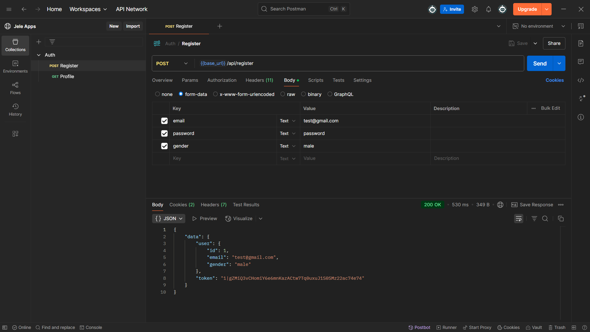
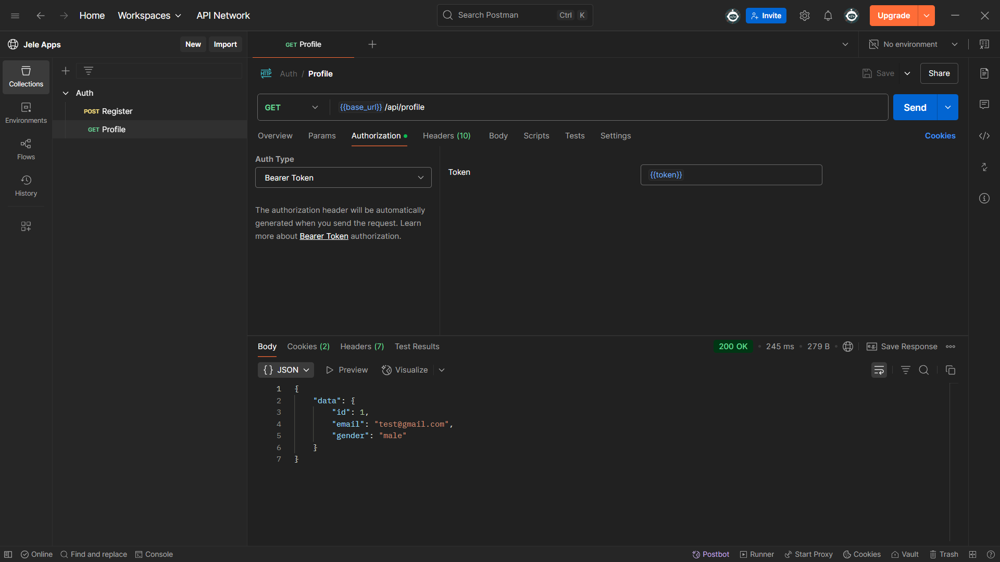

# Laravel API Проект

Этот проект представляет собой RESTful API для регистрации пользователей и управления профилями, разработанный на
Laravel 12.

## Основные функции

- ✅ Регистрация новых пользователей
- ✅ Просмотр профиля пользователя
- 🔐 Аутентификация через Sanctum
- 📦 Форматирование ответов через Resources
- 🏷 Типизированные поля через Enum

## Технический стек

| Технология | Версия    |
|------------|-----------|
| Laravel    | 12.x      |
| PHP        | 8.2+      |
| Sanctum    | Последняя |
| MySQL      | 5.7+      |

## Установка и настройка

1. Склонируйте репозиторий:

```bash
git clone https://github.com/diat01/jele-apps.git
cd jele-apps
```

2. Установите зависимости:

```bash
composer install
```

3. Настройте окружение:

```bash
cp .env.example .env
php artisan key:generate
```

4. Настройте базу данных в .env:

```ini
DB_CONNECTION = mysql
DB_HOST = 127.0.0.1
DB_PORT = 3306
DB_DATABASE = laravel_api
DB_USERNAME = root
DB_PASSWORD =
```

5. Выполните миграции:

```bash
php artisan migrate
```

## API Документация

### Регистрация пользователя

**Endpoint:**  
`POST /api/register`

**Параметры:**

```json
{
    "email": "user@example.com",
    "password": "secret123",
    "gender": "male"
}
```

**Возможные значения gender:**

- male
- female
- other

**Пример успешного ответа:**

```json
{
    "data": {
        "user": {
            "id": 1,
            "email": "user@example.com",
            "gender": "male"
        },
        "token": "1|AbCdEf123456"
    }
}
```

### Получение профиля

**Endpoint:**  
`GET /api/profile`

**Заголовки:**

```
Authorization: Bearer {token}
Accept: application/json
```

**Пример ответа:**

```json
{
    "data": {
        "id": 1,
        "email": "user@example.com",
        "gender": "male"
    }
}
```

## Скриншоты




## Тестирование

Для тестирования API используйте Postman коллекцию:  
[](https://app.getpostman.com/run-collection/37f88adedda0c3d1b3cd0bc76e37545e3d11a098a60521224d6698108125a971?action=collection%2Ffork&target-code=fa0bc17ad3a11c1d9aee0a0166808aa2)

## Разработка

Чтобы запустить сервер для разработки:

```bash
php artisan serve
```

Для запуска тестов:

```bash
php artisan test
```

## Контакты

Разработчик: Атагелди Дидаров  
Email: didarov.atageldi@gmail.com  
GitHub: [diat01](https://github.com/diat01)
